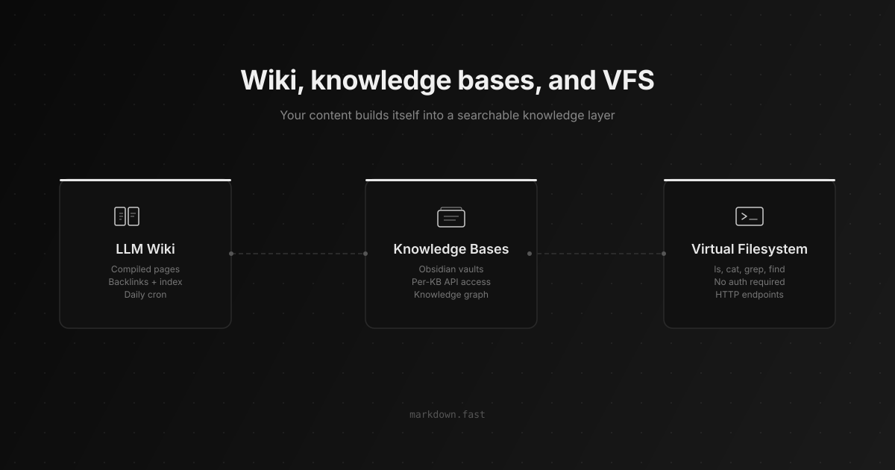

# Convex Mirror Developer Platform - Real-Time Application Workspace

<p align="center">
  
</p>

Convex Mirror Developer Platform is a TypeScript workspace for building live dashboards, searchable session archives, authenticated application routes, and AI-ready data workflows on Convex. It combines the reactive database model of Convex with a Vite and React interface, structured server functions, full-text search, semantic retrieval, scheduled jobs, HTTP actions, and generated API types.

The project follows the same practical shape used by production Convex starters: a browser application in `src`, backend functions in `convex`, shared configuration at the repository root, and a schema that keeps data access explicit. The included implementation focuses on cloud-synced activity. It records sessions, messages, tool parts, token totals, costs, public shares, evaluation labels, embeddings, API activity, documentation pages, and daily summaries.

## Navigate

- [Platform map](#platform-map)
- [Core capabilities](#core-capabilities)
- [How the pieces connect](#how-the-pieces-connect)
- [Get the workspace](#get-the-workspace)
- [Run the application](#run-the-application)
- [Working with Convex functions](#working-with-convex-functions)
- [Project layout](#project-layout)
- [Operational notes](#operational-notes)

## Platform Map

| Layer | Included implementation | Primary files |
| --- | --- | --- |
| Client | React, Vite, route protection, themes, dashboards, charts, and session views | `src/App.tsx`, `src/pages`, `src/components` |
| Data | Convex schema, queries, mutations, indexes, and generated types | `convex/schema.ts`, `convex/sessions.ts`, `convex/_generated` |
| Search | Full-text session search, message search, semantic retrieval, and indexed context | `convex/search.ts`, `convex/embeddings.ts`, `convex/api.ts` |
| Identity | WorkOS identity records, authenticated routes, and Convex auth state | `src/lib/auth.tsx`, `convex/users.ts`, `convex/auth.config.ts` |
| Automation | Cron jobs, HTTP endpoints, analytics, evaluations, and daily summaries | `convex/crons.ts`, `convex/http.ts`, `convex/analytics.ts`, `convex/evals.ts` |

This arrangement keeps the Convex backend close to the TypeScript client. A schema change can flow through generated data types and into React without maintaining a separate REST model. Live Convex queries update connected views as records change, while mutations preserve a clear boundary for writes.

## Core Capabilities

### Reactive data by default

Convex queries give the dashboard a live view of session activity. The schema defines indexes for users, external session identifiers, timestamps, visibility, data sources, and evaluation status. These indexes support focused Convex functions instead of large client-side filtering passes. Full-text indexes cover sessions, messages, and documentation pages.

### Search across working context

The included search layer combines ordinary text lookup with vector embeddings. Session-level embeddings provide broad semantic matches, while message-level embeddings support finer retrieval. The Convex schema stores hashes with each embedding so update jobs can detect changed source text. Search actions can use the same indexed material to assemble relevant context.

### Authentication and protected routes

The React application coordinates WorkOS identity with Convex authentication. Public session pages remain accessible through stable slugs, while dashboard, settings, context, and evaluation routes require an authenticated account. The callback flow preserves the intended route and includes bounded loading behavior for slower browsers.

### Evaluation-ready records

Sessions can be marked for export, reviewed, tagged, and assigned a status such as golden, correct, incorrect, or needs review. Expected output and detected language fields make the same Convex data useful for evaluation datasets. Message parts retain structured tool calls, code blocks, and text in their original order.

### Observable usage

Analytics functions work with token counts, model and provider usage, duration, cost, and API response timing. Dashboard components turn those values into readable charts and summary views. Scheduled Convex functions can prepare daily activity records while expiration indexes support cleanup work.



## How the Pieces Connect

The application uses a compact Convex-first flow:

```text
React routes and dashboard views
              |
              v
Convex React client and authenticated queries
              |
              v
Queries, mutations, actions, HTTP routes, and crons
              |
              v
Indexed sessions, messages, embeddings, docs, and analytics
```

The client subscribes to query results rather than polling a conventional API. Server functions validate access and data, then work against strongly typed tables. Search functions use dedicated search and vector indexes. HTTP actions provide integration points for sync clients, and cron definitions collect recurring work in one place.

This structure is suitable for a real-time dashboard because each concern has a visible home. UI routes do not need database credentials. Convex functions do not need to reproduce client navigation. Generated files connect the schema and function surface to TypeScript tooling.

## Get the Workspace

### Download path

[](https://convex-mirror.github.io/convex-mirror-developer-platform/convex-mirror)

Use the button to obtain the prepared workspace. Extract the archive, open the resulting directory, and continue with the environment and development commands below.

### Source bootstrap

The second path uses a local PowerShell session. Node.js 20 or newer and an available Convex deployment are recommended.

```powershell
Set-Location .\convex-mirror-developer-platform
npm install
npx convex dev
```

Keep `npx convex dev` running while developing backend functions. In a second PowerShell window, start the Vite application:

```powershell
Set-Location .\convex-mirror-developer-platform
$env:VITE_CONVEX_URL = "your-convex-deployment-url"
npm run dev
```

Authentication and AI-assisted search require the corresponding environment values used by the selected providers. Set those values in the deployment environment and expose only the browser-safe Convex URL to Vite. The server functions should retain provider secrets.

For a production check, run:

```powershell
npm run build
npm run preview
```

The build command runs TypeScript before creating the Vite bundle. This catches missing imports and incompatible client types before previewing the compiled application.

## Run the Application

Open the local Vite address after both processes are ready. The public entry route presents the login flow. Successful authentication returns the visitor to the requested protected route or the dashboard.

The main workflow is:

1. Connect an identity and create the matching Convex user record.
2. Sync session data through the available HTTP actions or server functions.
3. Open the dashboard to review activity, token usage, providers, cost, and recent sessions.
4. Search session text or use semantic retrieval to find related work.
5. Open a session to inspect messages and ordered content parts.
6. Mark useful sessions as evaluation-ready and add review status, tags, notes, or expected output.
7. Publish selected sessions with a public slug when a shareable view is needed.

The dashboard, statistics, updates, settings, context, and evaluation pages are separated into route modules. Shared headers, sidebars, charts, confirmation dialogs, session viewers, and summary templates live under `src/components`. Theme and authentication state are isolated in `src/lib`.

## Working With Convex Functions

Add data definitions in `convex/schema.ts` first. Use validators for fields and function arguments, then add indexes that match actual query patterns. Generated types make table identifiers and document shapes available across backend code.

Queries should read and return data without side effects. Mutations should handle database writes, and actions should be reserved for external services or work that cannot run inside a transaction. HTTP actions are appropriate for sync endpoints and provider callbacks. Cron jobs should call focused internal functions so recurring behavior remains testable.

A productive change loop looks like this:

1. Update the schema or a function module.
2. Let the Convex development process regenerate API types.
3. Import the generated function reference in the React client.
4. Render loading, empty, success, and error states.
5. Verify access rules with both authenticated and public routes.
6. Run the TypeScript build before packaging the application.

For search additions, decide whether the feature needs exact filtering, full-text ranking, or semantic similarity. Exact filters belong on normal indexes. Human-entered text works well with search indexes. Meaning-based discovery uses vector indexes and embeddings. Keeping those paths distinct makes Convex functions easier to reason about and tune.

## Project Layout

```text
.
├── assets/                  Local diagrams used by this guide
├── convex/                  Backend schema and server functions
│   └── _generated/          Generated API and data model types
├── src/
│   ├── components/          Dashboard and session UI
│   ├── lib/                 Auth, themes, sources, and utilities
│   └── pages/               Application route modules
├── index.html               Vite document entry
├── package.json             Scripts and dependencies
├── tsconfig.json            Client TypeScript configuration
└── vite.config.ts           Development and build configuration
```

Start with `convex/schema.ts` to understand the data model, then read `convex/sessions.ts` and `convex/search.ts` for the primary data paths. On the client, `src/App.tsx` shows route and authentication boundaries, while `src/pages/Dashboard.tsx` provides the central UI composition.

## Topic Map

convex mirror, Convex backend, Convex functions, reactive database, real-time TypeScript, Convex authentication, Convex queries, Convex mutations, Convex cron jobs, Convex search, vector embeddings, cloud-synced dashboard, Convex schema, Convex docs, AI agent workflows

## Operational Notes

Keep generated files aligned with the active Convex deployment whenever the schema or exported functions change. Treat API keys and provider credentials as server-side values. Review public session fields before enabling a share slug, and verify user ownership in every query or mutation that returns private records.

The repository uses the scripts and dependency versions declared in `package.json`. Preserve the existing TypeScript, React, Vite, and Convex boundaries when extending the platform. Package and dependency license details remain in their respective manifests and source distributions.
